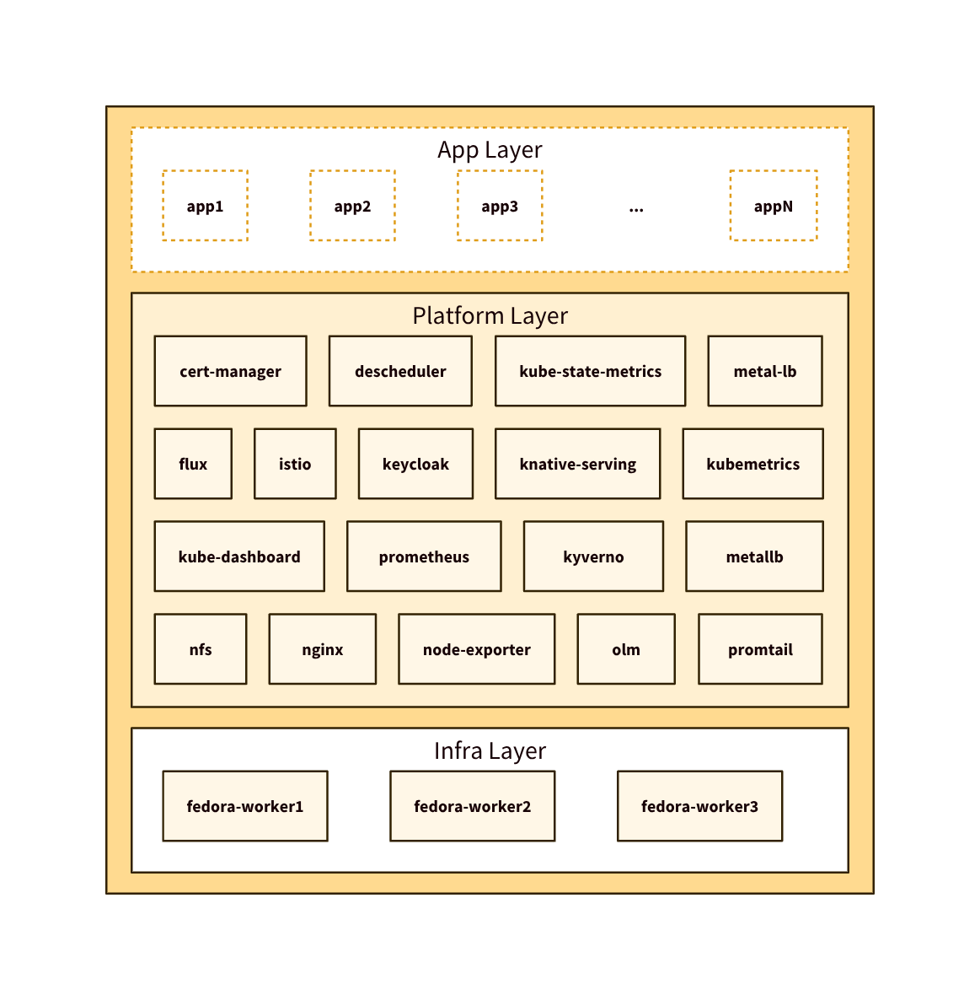
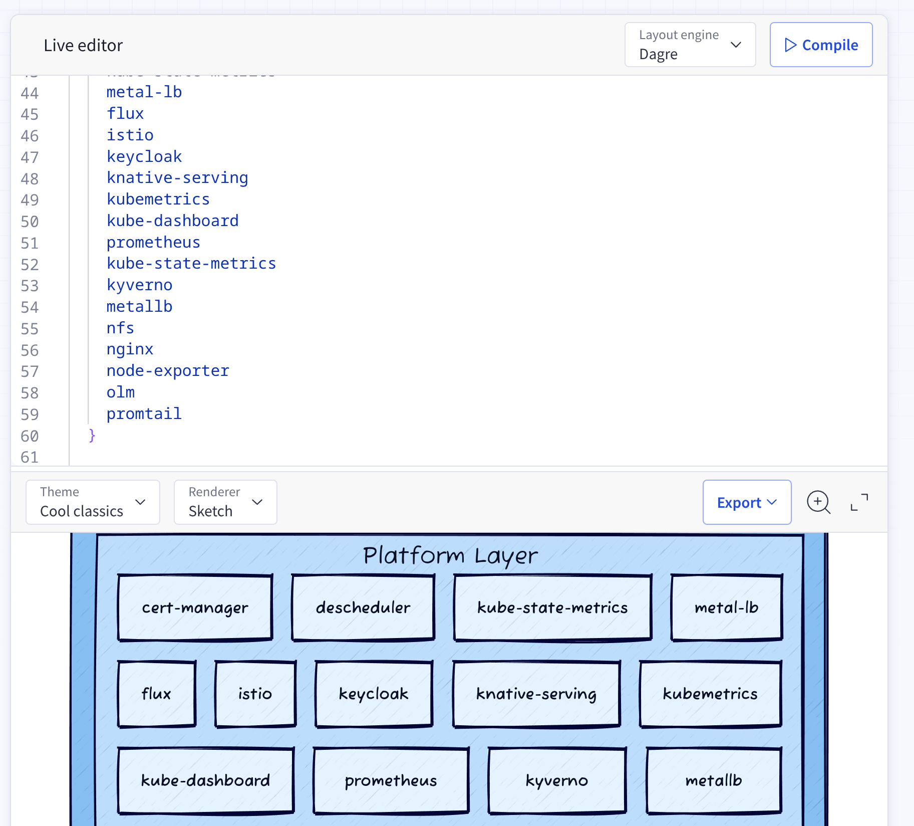

Many people are familiar with the concept of using markup languages to develop diagrams, like GraphViz's dot Language, or PlantUML. These languages allow users to define diagrams in a text-based format, which can then be rendered into images. If you are not familiar with these tools, check them out - they're seriously faster for diagram editing and updates than manually drawing boxes in diagramming tools, like some sort of neandertal!

* [GraphViz](https://graphviz.org/): a popular open-source tool for creating graphs, as the name suggests - like directed acyclic graphs (DAGs). 
* [PlantUML](https://plantuml.com/): another widely used tool that allows users to create a variety of diagrams, but it has a particular focus on UML.
* [Mermaid](https://mermaid-js.github.io/mermaid/#/): a JavaScript-based diagramming and charting tool that uses a simple markdown-like syntax, and it supports quite a few diagram types. One of the nice things about Mermaid is that it can be easily integrated into web applications and documentation platforms - and it's supported in GitHub markdown files!
* [C4 Model](https://c4model.com/): a framework for visualizing software architecture at different levels of abstraction. While not a diagramming language per se, it provides a structured approach to creating architecture diagrams.

However, when you specifically want to draw architecture diagrams - layers of a stack that interact with each other, users, and external systems - I found that languages and tools listed above to be limiting. In particular, lining up boxes and layers of the stack is impossible, or tedius. 

Enter [D2](https://d2lang.com/): a modern diagramming language designed to make it easy to create diagrams using a simple and intuitive syntax. D2 focuses on ease of use, readability, and maintainability - but it's **Grid drawing** mode is what really makes it shine for architecture diagrams. Let's start by looking at the output of a simple architecture diagram drawn in D2:



Looks great, I think! 

Here's the D2 code that produced the diagram above:

```yaml
classes: {
  label.near: top-center
  app: {
    style: {
      stroke-dash: 2
      fill: transparent
    }
  }

  transparent: {
    style: {
      fill: transparent
      stroke: transparent
    }
  }
}

stack: "" {
  label.near: bottom-center
  grid-columns: 1
  horizontal-gap: 24
  vertical-gap: 20

  apps: {
    label: "App Layer"
    label.near: top-center
    style.fill: "#fff"
    style.stroke-dash: 2
    app1.class: app
    app2.class: app
    app3.class: app
    appdot.class: transparent
    appdot.label: "..."
    appN.class: app
  }

  kube-infra: "Platform Layer" {
    label.near: top-center
    grid-rows: 4
    grid-gap: 22
    cert-manager
    descheduler
    kube-state-metrics
    metal-lb
    flux
    istio
    keycloak
    knative-serving
    kubemetrics
    kube-dashboard
    prometheus
    kube-state-metrics
    kyverno
    metallb
    nfs
    nginx
    node-exporter
    olm
    promtail
  }

  workers: "Infra Layer" {
    style.fill: "#fff"
    label.near: top-center
    fedora-worker1
    fedora-worker2
    fedora-worker3
  }
}
```

If you're interested about the actual diagram in particular, it's for a project called "AmberKube", here; https://github.com/jamesread/AmberKube/blob/main/docs/source/assets/architecture.d2 

A few things to note about D2 and this example:

1. **Grid Drawing Mode**: The `stack` construct allows you to create a grid layout easily. You can define rows and columns, and D2 takes care of aligning the elements for you. This is particularly useful for architecture diagrams where you want to represent different layers or components in a structured manner.
2. **Styling**: D2 provides a straightforward way to apply styles to your diagram elements. In the example, we define styles for classes like `app` and `transparent`, allowing for consistent styling across similar elements.
3. **Readability**: The D2 syntax is designed to be human-readable, making it easy to understand the structure of the diagram just by looking at the code. This is beneficial for collaboration and maintenance.

One of the cool things about the D2 language is that they offer a super nice "playground" - so nothing to install on your machine necessarily. 

* https://play.d2lang.com/

This playground allows you to write D2 code and see the rendered diagram in real-time. It's a great way to experiment with the language and quickly prototype diagrams. I really like the "sketch" style option, and that you can change the theme with a simple click; 



Overall, if you're looking for a powerful and easy-to-use tool for creating architecture diagrams, D2 is definitely worth checking out. Its grid drawing capabilities, combined with its simple syntax and styling options, make it a great choice for visualizing complex systems and architectures.

If you're interested in having a play with D2, copy my architecture diagram code above into the [D2 Playground](https://play.d2lang.com/) and fiddle around with it!
