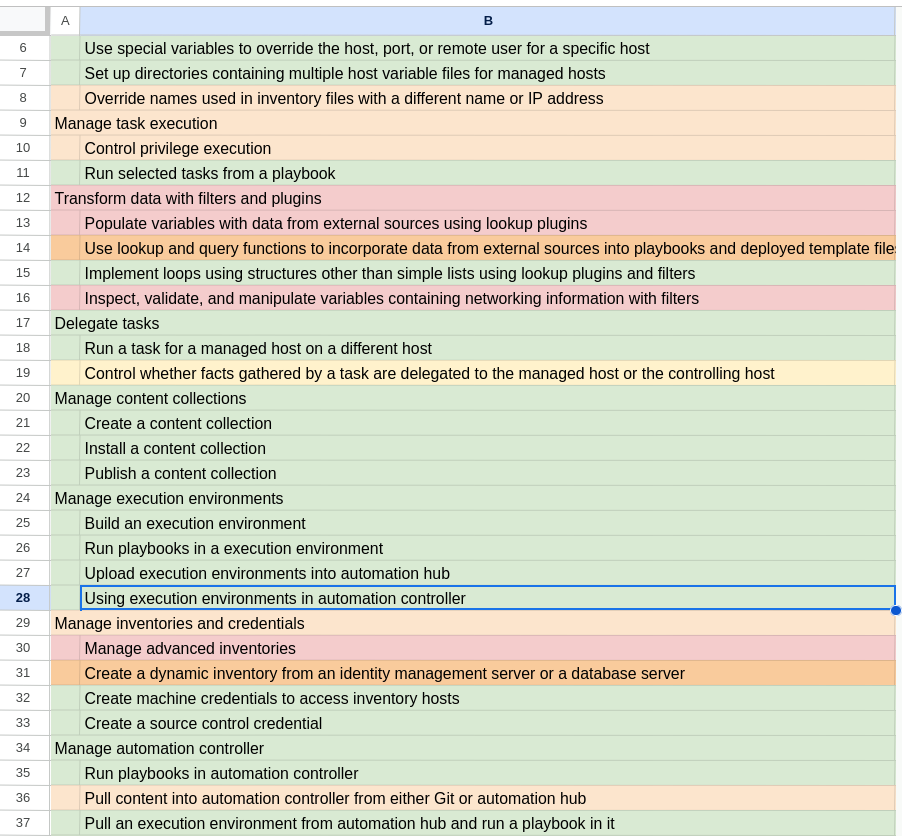

I love Ansible, and I love doing certifications - so this was a no-brainer. In this blog I'll talk about how I prepared, how the exam felt, was it worth it, and at the end I'll even explain why I used a cow image as the cover for this blog post! [^1]

<!--more-->

That feeling you get after passing a certification is so great, each time you pass a certification. I don't know about you, but as soon as I see a "PASS" email, I immediately start looking for the next one to take!

This is my forth Red Hat certification in the last few weeks, and I've just had enough energy to post a blog article about it this time. I recently undertook took the certification on **1st September 2023**, and it was based on **Ansible automation Platform 2.2**, the exam was **4 hours**, which I took as an "individual exam" in the comfort of my own home.

## Preparation

When getting ready for any exam, my first step is to extract the officially published [Exam Objectives](https://www.redhat.com/en/services/training/red-hat-certified-specialist-developing-automation-ansible-automation-platform-exam?section=objectives), and organize them into a good old spreadsheet. I then color-code each sentence green, amber or red. Green signals that the topic is well known, amber hints at familiarity, and red serves as a reminder to hold my ambition back, and try learning the topic before booking the exam! This visual roadmap is great for maintaining motivation, and at a glimpse tells me how much left there is to do. Here's what that spreadsheet looked like for me towards the end of my revision;

I had really not used Ansible Automation Platform that much before this exam, but I did approximately 8-12 hours of intense studying up on it, with a real instance deployed in my homelab. Notice from my spreadsheet that I didn't wait until *everything* was green before booking the exam - otherwise you end up in a state of being a bit unsure if you've done enough revision. There are also some areas, like "Manage advanced inventories" that could mean anything.

## A homelab is a perfect substitute for "real world experience"

Because I work for Red Hat, and I'm not one of the many engineers out there today using Ansible in anger in "real world" environments, means I need to force myself to find ways to gain as close to real world experience as possible. For that, I have my homelab. I've been using Ansible in my homelab for many years now, and deliberately took the decision to create an Ansible collection back when they were new, in 2019. [jwr-soe-ansible](https://github.com/jamesread/jwr-soe-ansible) (James W Read's Standard Operating Environment) is a collection I've been building over time and that exposes me to a lot of Ansible stuff. In particular, I set myself the challenge to keep that collection maintained with minimal / zero lint warnings and errors - which can be a real challenge with Ansible sometimes!

## How did the exam feel?

The exam environment again worked flawlessly for me - but do take time during the exam setup to configure your keymap appropriately (it defaults to US, which is horrible for a UK keyboard). I also spent at least 10 minutes at the start of the exam configuring my .vimrc, terminal color scheme (erw, I hate "dark mode"), and getting rid of stuff in Firefox that I didn't like. I do this at the start of all the Red Hat exams and it really helps to be comfortable in the exam environment.

The timing worked out great, 4 hours felt exactly right, there's quite a lot to do, but like any Red Hat exam, you need to be careful about reading the questions carefully, looking for any gotchas or subtle details.

## Was it worth it?

Preparation for the exam pushed me deeper into ansible-navigator, Execution Environments and Private Automation Hubs - areas I had little understanding of before. Initially, I was unaware how these puzzle pieces fit together and what purpose they served. Now I know those details a lot better - so, yes, I'd say it was worth it!

## Conclusion

The journey with the Red Hat Ansible Automation Platform 2.2 certification was both challenging, and rewarding. If you're considering a similar challenge, remember that preparation is key, personalising your exam environment can make a significant difference, and certifications are a perfect way to become more well-rounded in a technical topic. Certifications are one type of education that I personally enjoy, but I'll never lose sight of the fact that expertise is a combination of both education, and real world experience.

[^1]: I used a cow image as the cover for this blog post, as SiFi and space (Ansible), and pictures of robots (for Automation) are just too predictable. O'Rilley used a [cow on their book](https://www.oreilly.com/library/view/ansible-up-and/9781098109141/), so why not me?
