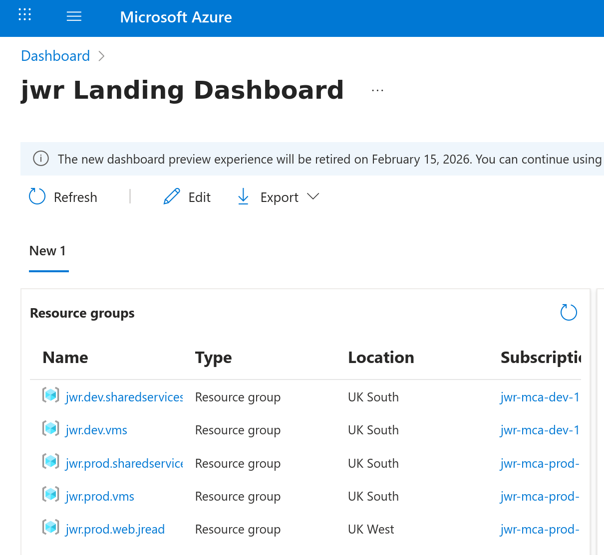
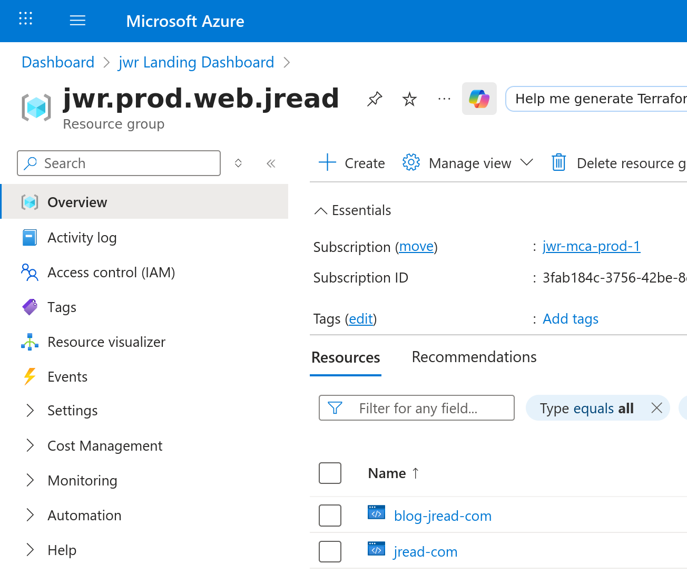
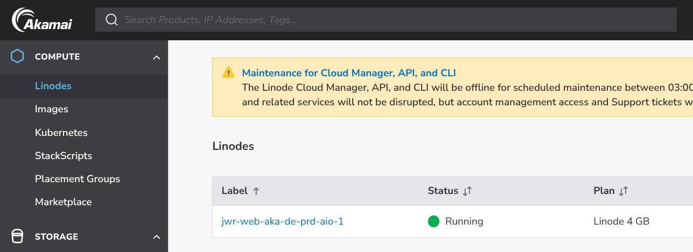
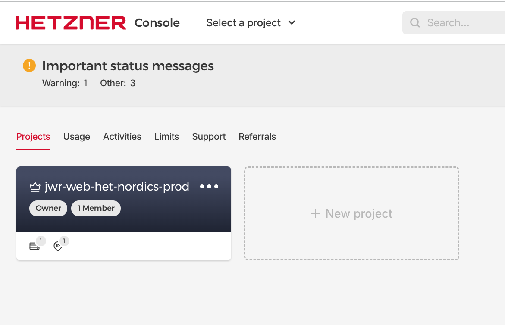

A quick snapshot of the cloud providers I'm still using in 2026—what I use, why, and a few recommendations that may be relevant to single developers, self hosting enthusiasts, and similar.

<!--more-->

## [Azure](https://azure.com)

I work with Azure daily; my expertise is Red Hat on Azure—configuration and optimisation. I also have a solid grasp of how enterprises structure Azure (subscriptions, policies, landing zones). That matters if you're evaluating Azure for work or trying to align with enterprise patterns.

I use spot VMs and keep subscriptions and resource groups in a realistic, recommended structure—so things stay organised and my bill stays low. I find Azure's portal and tooling the clearest of the hyperscalers. That helps when you're learning the platform or managing many resources.

* **Advantages:** Big enterprise cloud; comprehensive, with a service for almost everything. Azure is trusted by many of the largest enterprises and has strong documentation on adoption. (I'm basied here - I'm the Azure Solution Architect at work!)
* **Usage**: Azure Static Web Apps (one of the mirrors for https://jread.com, and this blog!), development, testing.

## [Linode/Akamai](https://cloud.linode.com)

Linode (now Akamai) continues to be a fond choice for straightforward cloud VMs and infrastructure projects that just need a VM quickly. It's well-known among developers for its no-nonsense approach: simple pricing, reliable performance, and a user interface that's refreshingly easy to navigate compared to the sometimes overwhelming dashboards of larger providers.

While Linode isn't always the absolute cheapest "per vCPU" in 2026, the difference is more than made up for by how smooth the experience remains—from spinning up a server to configuring backups and networking, everything just works. For side projects, quick prototypes, persistent personal servers, or anything where I want to know exactly what I'm getting for my money each month, it's been hard to beat.

* **Usage**: One of the 3 primary backend servers of my production web cluster is hosted here in Germany. Zero problems with stability and uptime so far.

## Hetzner

Hetzner is my go-to for high-performance dedicated servers in Europe at very low prices. Their server auctions let you get powerful hardware for a fraction of the cost elsewhere. That makes them ideal for budget-conscious hobbyists and for anyone who needs reliable infra without hyperscaler pricing.

What sets Hetzner apart beyond just price is transparency: predictable billing, clear specs, and a customer portal that stays out of your way. Data privacy is also reassuring, given their exclusively European datacenter locations. Over the years, I've used Hetzner for everything from hosting critical web services and CI/CD runners, to private backup solutions and test environments—I've yet to be let down by uptime or support responsiveness.

* **Usage**: One of the 3 primary backend servers of my production web cluster, hosted in the nordics.

## Cloudflare Workers

This is one of my newest cloud environments, as I had to start putting my sites behind a CDN - and Cloudflare workers were just there and available to use. At the moment I still just have a single domain - literally just one of my testing domains that hosts a picture of a rock. Yep.

https://pyroxenite.tech/ - if you're interested.

## Runpod

Runpod is newer in my stack—I use it only for remote GPU. Spinning up a vLLM instance with your preferred model is straightforward; connect and you're self-hosting. It feels truly on-demand: I can grab a 5090 for a few hours and tear it down without the usual quota or commitment headaches. That matters if you're experimenting with LLMs and don't want to lock into a long-term reservation.

---

## Summary

* **Azure** — enterprise alignment, static sites, dev/test. Best when you need breadth and enterprise patterns.
* **Linode (Akamai)** — straightforward VMs, predictable pricing. Best when you want a server without fuss.
* **Hetzner** — cheap, powerful dedicated hardware in Europe. Best when price/performance and European presence matter.
* **Runpod** — on-demand GPU, self-hosted LLMs. Best when you need bursty AI workloads without long-term commitment.

Together they cover static hosting, general compute, dedicated servers, and GPU. Pick by workload and budget, not by brand. What's in your mix? I'd be curious to hear which provider you'd add or drop—and why.
