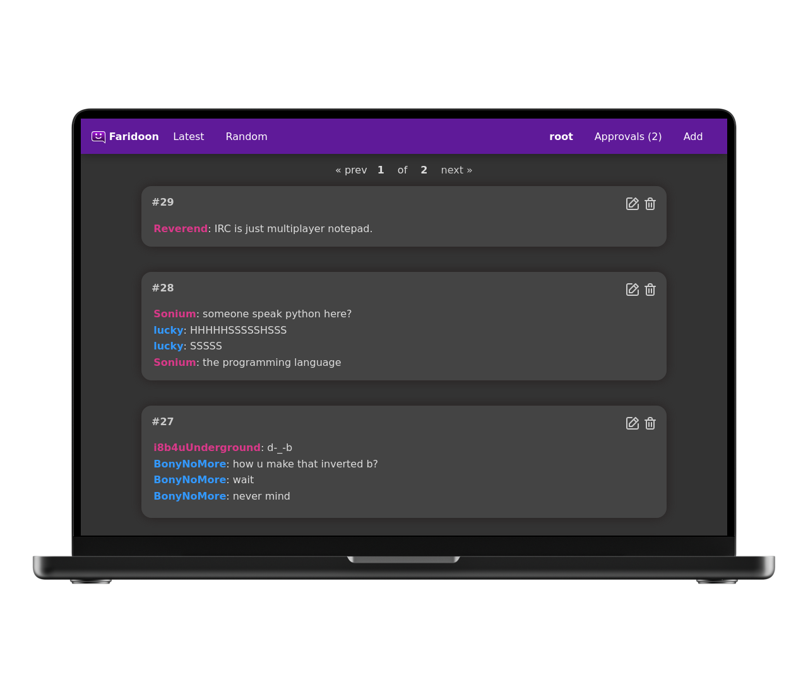
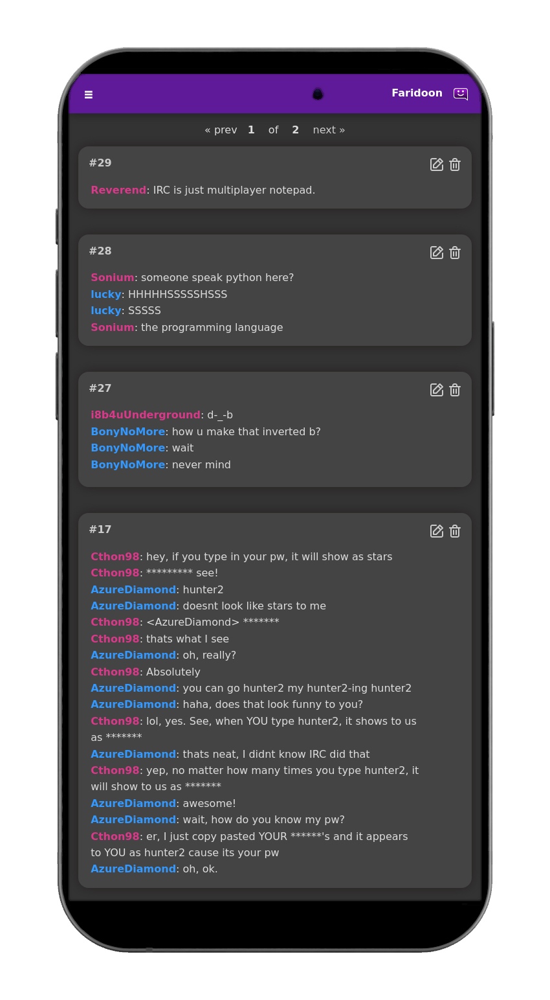

So many interactions with friends, family and coworkers now happen via our chat apps, and so many of the best bits of these chats just scroll by and are forgotten. Faridoon is a simple app that lets you save and publish your favourite chat quotes for you to save, for your community, or for the world to see.

I was inspired to write Faridoon a long time ago, when I was chatting with friends mostly on Mumble chat. We really liked the awesome simple interface of bash.org (now long since gone), but wanted to save our own quotes.

Faridoon is free, open source software, and so you can run it anywhere where you can run a docker container. The app is tested and well maintained, and I thought I'd share a few pictures below of what it looks like;

It may be interesting for you to know, but Faridoon is what I call "No-Nonsense Open Source". Here is what I define that as;

- All code and assets are Open Source (AGPL).
- No company is paying for development, there is no paid-for support from the developers.
- No separate core and premium version, no plus/pro version or paid-for extra features.
- No SaaS service or "special cloud version".
- No "anonymous data collection", usage tracking, user tracking, telemetry or email address collection.
- No requests for reviews in any "app store" or feedback surveys.
- No prompts to "upgrade to the latest version".
- No internet-connection required for any functionality.

I'm eager for more people to learn about Faridoon and use it, so I'm sharing it here in this blog post.

To learn more about how to get started with Faridoon, here are some links to get started:

- [Faridoon Documentation](https://jamesread.github.io/Faridoon) - check the "Installation" section.
- [Starring the project on GitHub](https://github.com/jamesread/Faridoon) - is something I always appreciate.

If you have any questions or feedback, feel free to either open an issue on the GitHub repository or get in contact with me directly at [https://jread.com](jread.com).
