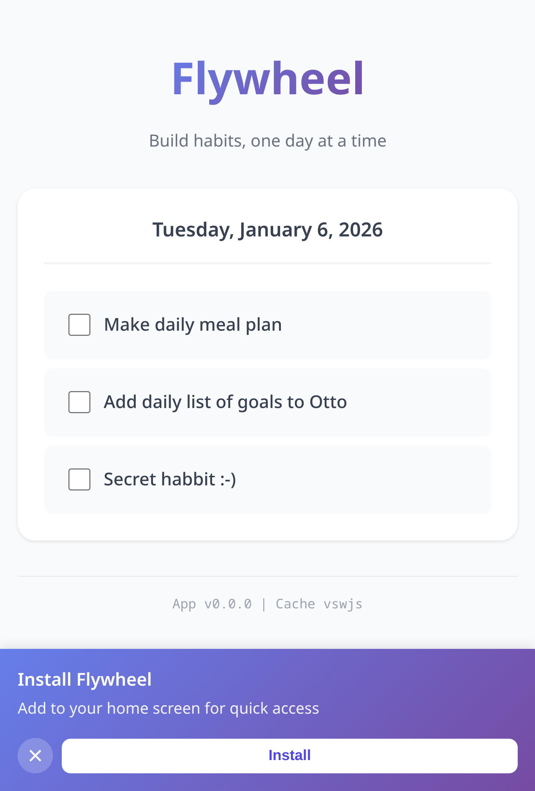

This article started life in **October 2024** as a "**Initial reaction to using Cursor.AI for a few hours**" - as the provisional title suggests, I was trying out Cursor.AI for the first time - and it was not love at first sight! As an eager user of vim (and now, [neovim](https://blog.jread.com/posts/i-switched-to-nvim/) more recently) I was curious to see how well this AI-powered code completion tool would integrate into my existing workflow.

In 2024 I was not using AI Coding tools extensively, but I'm a strong believer in the principle of **if you don't try, then you won't know**. Quite frankly it's dangerous to dismiss AI in the tech world today. [In 2025 I increased my AI usage quite a bit](https://blog.jread.com/posts/snapshot-of-ai-usage/), and in 2026 I don't see myself slowing down with AI at all.

Anyway, Cursor - I'll share with you the thoughts I had at the time (in November 2024), as long as you promise not to judge me - my opinions may have changed since then!

* The amount uploaded to the cloud is nuts, I need a user account to "login" to my text editor?! 
  * This is basically a keystroke logger?!
* Cursor.ai [at the time], can't access to commit history. How can it check any context?
* Setting up a new colour scheme / choosing colours is just annoying. I think I had to edit a config file to get the colours I needed. 
* Couldn't find a way to open the terminal properly

## I like Cursor.ai now!

Fast forward to early 2026, and I'm using Cursor.ai almost daily now. However, I am still ALSO using neovim (even writing this article in neovim).

Why? Well, I've actually come to really enjoy using Cursor.ai, and I've overcome the initial frustrations about having to login, setup keybindings, and so on. While the AI "auto-completion" is good, I find that the agentic based "vibe coding" approach has allowed me to focus more on the high-level approach, rather than getting fixating on the implementation. 

I think that a common perception is that AI assisted development is **faster**. My experience so far isn't that it's necessarily faster, but it's **perceived to be faster** by the developer, because they can focus on the high-level design, rather than the low-level implementation. With AI, my **net-output of code is MUCH HIGHER**, but that's not because AI is necessarily typing faster (although it obviously can), but because I'm not getting bogged down in the details. I can think about adding a feature, and then details in the documentation, and README, without having to worry about how I structure the implementation of those individual parts.

One thing I'm really trying to teach myself is that being a "snob" about AI-written code is just silly. I think it's natural to assume that AI code is terrible - especially for me because writing code has been my hobby. However, AI can, and does produce good code with sufficient supervision. Yes, it can produce utter garbage too, and you need to have experience to spot the difference, and correct as needed. However, if you are dismissing AI code out of hand, then you're missing out on a huge opportunity to be more productive.

A case in point, I wanted a super-simple daily habbit tracker checklist on my mobile - a progressive web app. I could have cranked that out in a few hours myself, but it took 4 Cursor AI prompts, with zero code review, and I have a fully working app.  

I **absolutely don't care about the implementation** of this, I just want an app now that works. 

## I also still like neovim!
Contrast that with this blog post (ironically, I'll spend more time "hand writing" this post than I did that flywheel app!). I don't want automatic AI generation here, I want to write it myself. That's why I'm using neovim. 

I have neovim setup with lots of plugins for writing code, and I enjoy using neovim for writing code; I like the simplicity, the customization, and the speed of neovim. However, it is not my only editor for writing code - neovim is my tool of choice for "Non-AI" editing, and Cursor.ai is my tool of choice for "AI-assisted" editing. It's OK, and I think healthly, to have different apps for different tasks.

## Summary 
I still write a lot of code by hand, without any AI assistance. Equally, I do sometimes write apps fully with AI. It's not a binary choice, it's a tool in the toolbox. Use it when it makes sense, don't use it when it doesn't.
