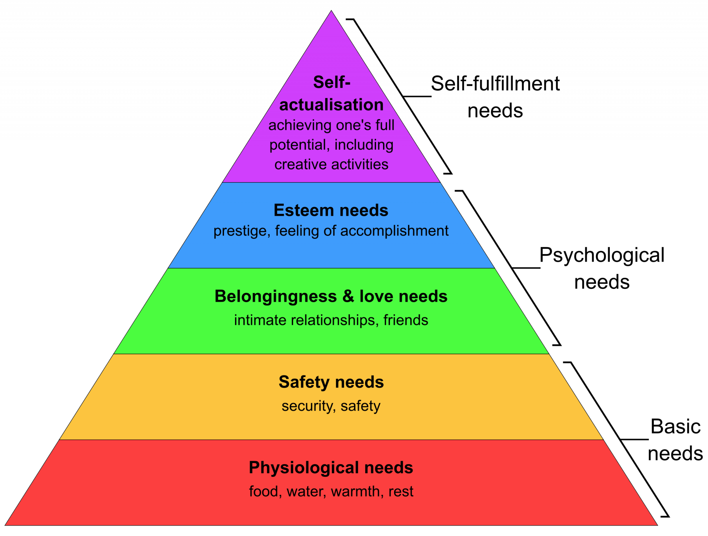
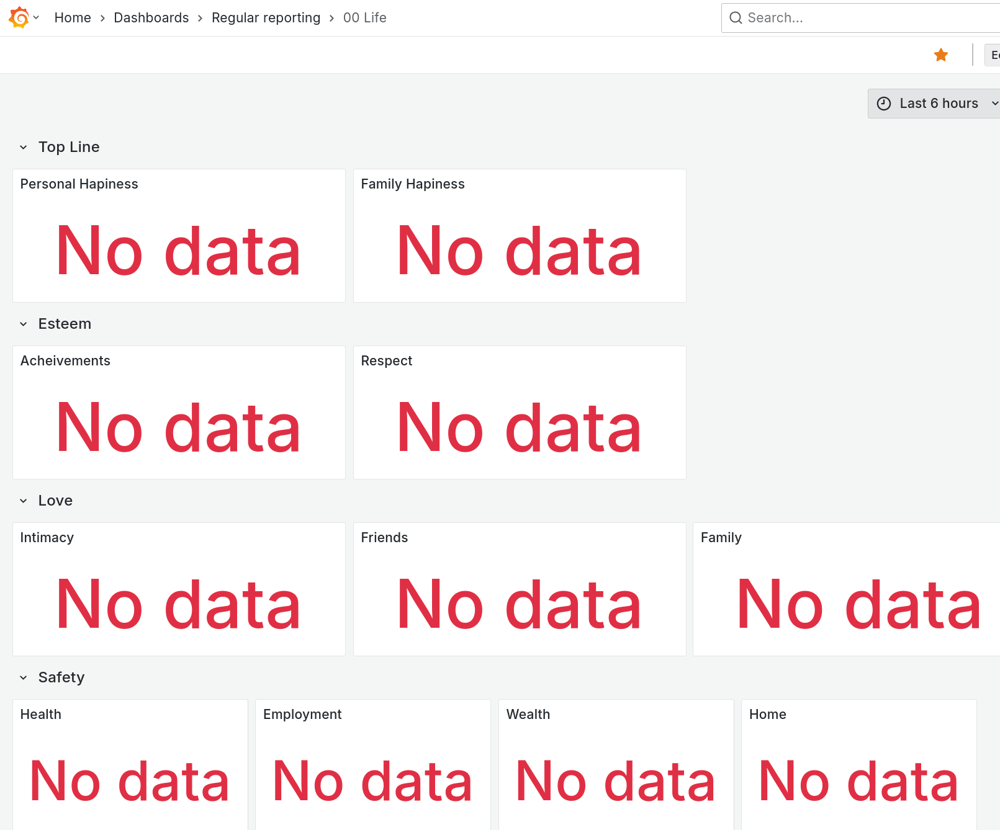
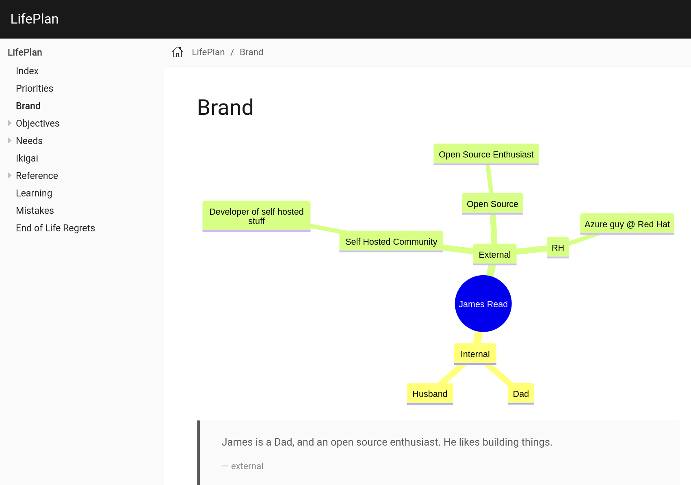
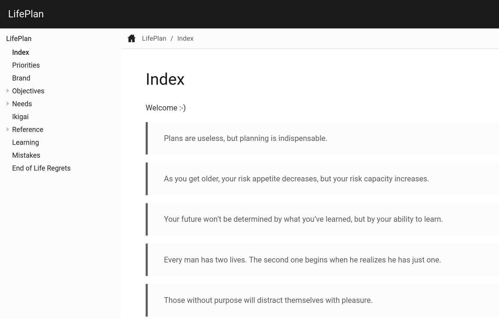
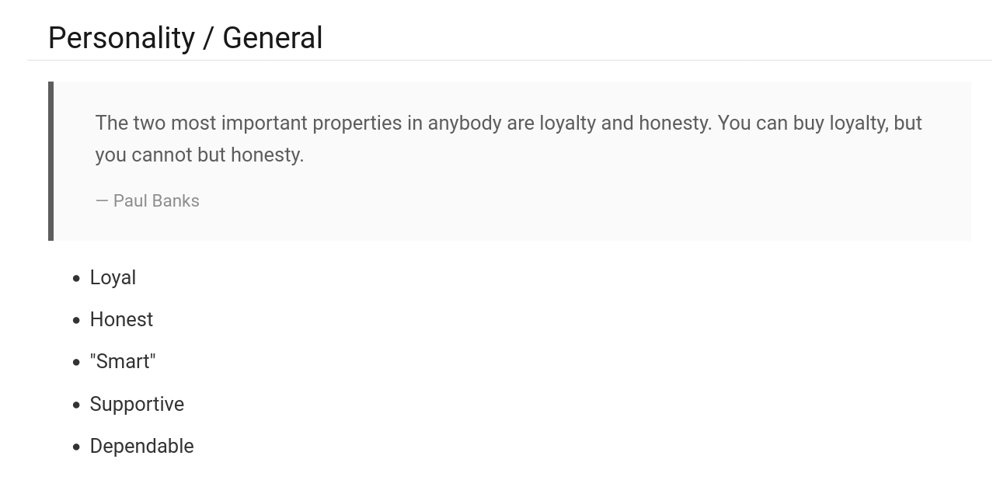
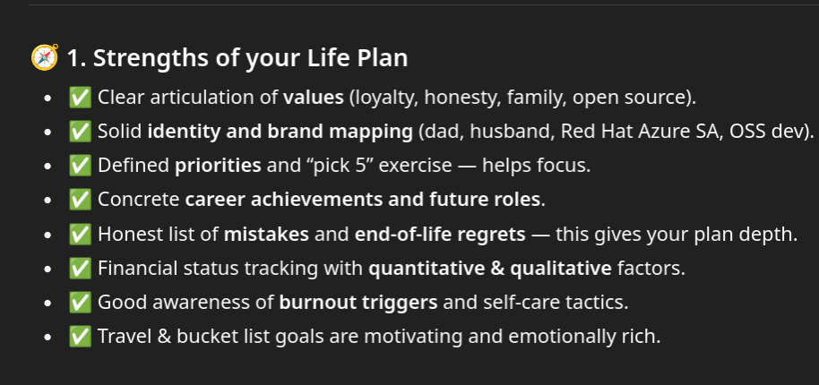
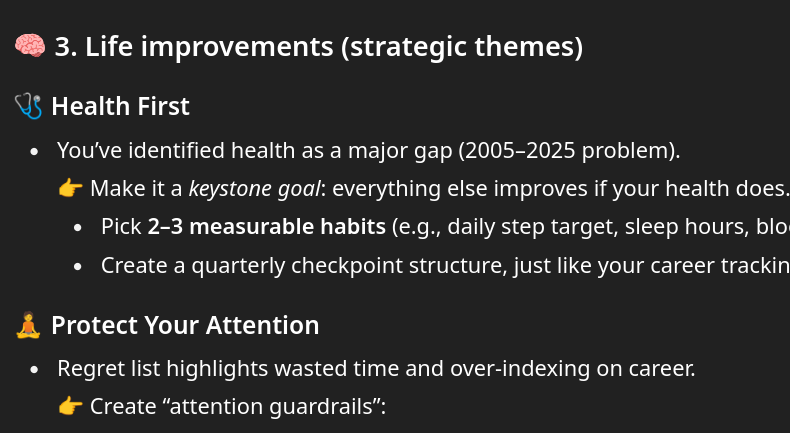

## The problem statement

When you're young, single, without family and with a job that you love, it's easy to give that a lot of focus and energy. When I was promoted to Principal Solution Architect at work, I was about 12th in EMEA, and the youngest by a long way - in March 2019 at age 32. Soon after that I got married, started a family, COVID happened (!), bought a much nicer house and I would say life got a lot more complicated! As much as I am incredibly grateful for my wife and family, and I obviously not trade those in for anything, it's been incredibly difficult to balance the newfound energy for my new home and new family, and my career just happened in the background.

Now I've got several marriage anniversaries ticked off (yay), a couple of kids who are aged 2 and 5 (so, not quite baby-stage anymore), and a house that is well decorated. This means I've had some "spare energy", but it's not as easy as putting that energy back into my career again. I decided to try and take a broader perspective, and make a **plan**... for the rest of my life!

Getting started with that is an incredibly tricky task in itself - the scope is basically everything! Taking from what I knew already, something that stuck in my mind was Maslow's Hierarchy of Needs:

## Structure & Scope



This may not be perfect, and it may not reflect the current best thinking of psychology, but it's a model I can easily understand. I really like that it starts with the most basic needs, and then builds up to more abstract needs. I can see that I need to make sure that my basic needs are met before I can focus on higher-level needs.

Since starting with this model to define the structure and scope, I've found several other models that are complementary, and additive to this. One of these is the [Ikigai](https://en.wikipedia.org/wiki/Ikigai) model, which is a Japanese concept that means "a reason for being". The idea is that everyone has an ikigai, and it's the intersection of what you love, what you're good at, what the world needs, and what you can be paid for.

I've also found that documenting achievements and previously met goals is really helpful for motivation, just as important as setting new goals. 

## Documenting the plan

I needed to start documenting these, and my first thought was to try to do this in Grafana... yes, you read that correctly!



Yep, surprisingly it's difficult to be able to implement metrics about all these areas of your life. I needed a different approach.

Of course, I did think about creating an app for this - because apparently as a software engineer every problem, of every size is a nail that I feel compelled to hit with my developer hammer. Nevertheless, I actually /didn't/ start creating a new app, thank goodness, and instead thought I'd just start documenting this in a more traditional way. Well, ASCII Doc, of course, I'm not going to be a barbarian and use Word or Google Docs for this!

Having had such fantastic recent experiences with Antora for building documentation, for projects like docs.olivetin.app, and it was an easy choice.  





Okay! this is looking better. Antora can also do awesome diagrams as well. 

Now that I've got a system for documenting and capturing this, it make be really enthusiastic to fill out the page content - health, travel, future roles, etc - it really became addictive. Because everything was a single page, with a narrow focus, it was really easy to just keep going and going.

I've built up my life plan now in quite a lot of detail. Obviously lots of it is pretty sensitive stuff - I've documented bits about my health, my career, wealth, etc, and naturally I won't be sharing any of that. However, so that this might be useful for you, let me share the current table of contents I have - and this might give you some ideas for your own life planning documentation:

```
* Index
* Priorities
* Brand
* Objectives
** Achievements (TODO)
** Travel
** Holidays
* Needs
** 5. Self-Actualization
*** Creativity
*** Acceptance
** 4. Esteem
*** Achievements
*** Respect
*** Career
**** Heatmap
**** Mentors
**** Aspirants
**** Likes & Dislikes
**** IC vs People Manager
**** Red Hat Loyalty (Private)
**** Future Roles
***** Sr. Pr SA
** 3. Belonging
*** Friends
*** Family
*** Romance
*** Community
**** MHND
**** Pride
** 2. Safety
*** Health
*** Employment
*** Wealth
*** Home
** 1. Physiological (all good!)
* Ikigai
* Reference
** Burnout
** Soft Skills
*** Sales
*** Planning
* Learning
* Mistakes
* End of Life Regrets
```

This is going to be a ever-growing document and table of contents, but it's super interesting to force yourself to start thinking about this format.

## Checkpoint: Everything is in one place, and structured

So far, so good. I've got everything in one place, and it's structured. This is a massive improvement that allows me to **browse my thoughts** about life and help me with planning. I've littered my favourite quotes around the documentation which is something I really respond with. 

For example, here's a small snippet of my "brand" page.



# Next Steps: AI

It took me quite a while to get this idea, but because I'm using AI now so aggressively in my day to day life, I figured that all the information /about me/ is in one place, and now I can use LLMs to ask it about me! All I needed to do was output the life plan as a PDF (thanks to the [pdf-extension](https://www.npmjs.com/package/@antora/pdf-extension) this is very easy indeed to export and upload to ChatGPT for parsing. 

The first question I asked ChatGPT 5 was what it thought about my life plan - good first impressions it seems!



Then of course, it does have some really interesting improvements (quite a lot of them).



This has given me a super useful tool to bounce ideas off, look for areas of strength, weakness, or poor documentation coverage! I'll definitely be using this as a tool to help me with my life planning going forward.
