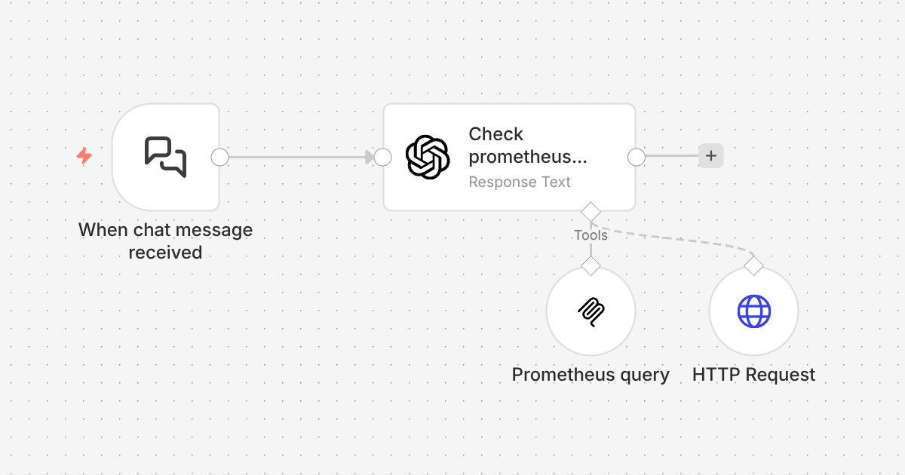
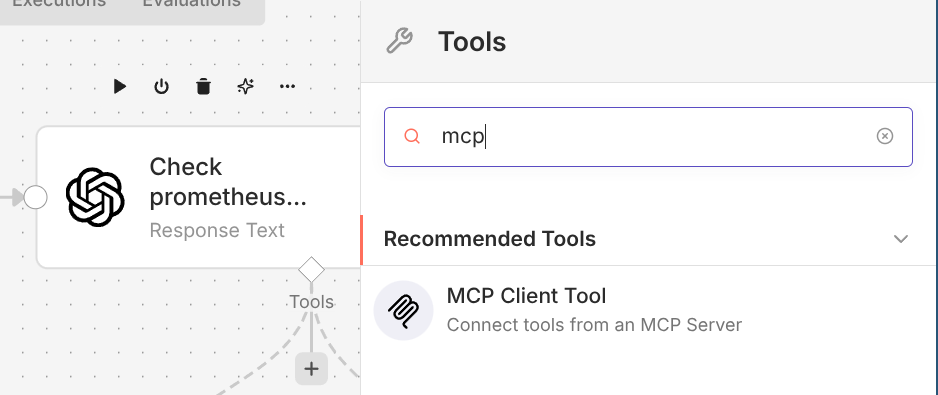
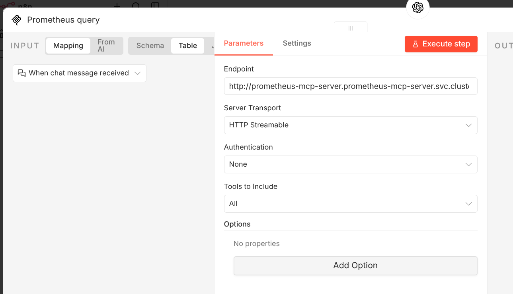
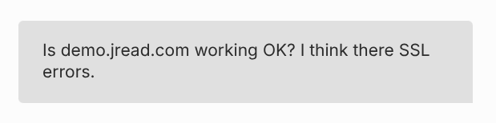
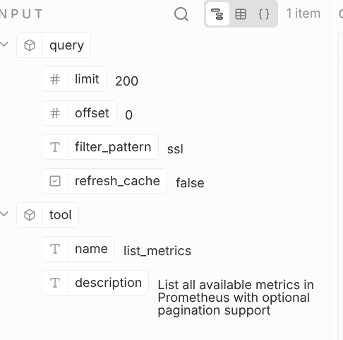
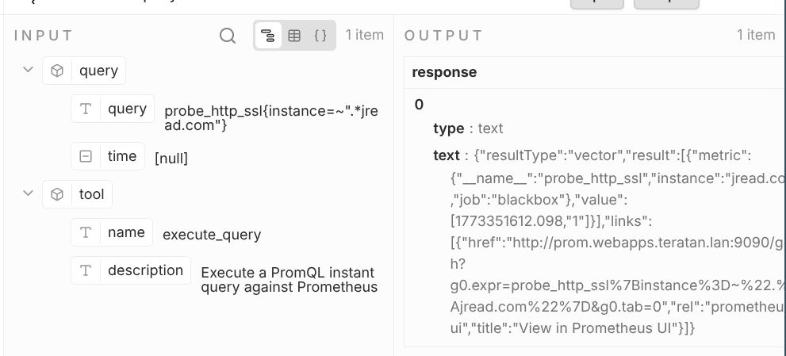
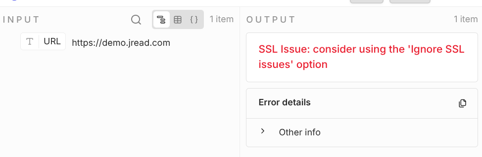

Many people don't have access to enough GPUs running in their own internal network to run LLMs, and at the same time, they want to be able to able to surface data to that LLM without putting the data publicly available online. n8n offers a nice solution to do this.

<!--more-->

By means of example; I've been using Cursor to surface context stored in plain text files to agents that run in the public cloud. The interface is very easy, open Cursor to the directory you want to "share", and the IDE will easily inject those files as needed as context to the LLM. I use this for notes files, life plans, and sometimes blog posts (I ask the AI to review hand-written blog posts - not to write the post).

But what if your data is more complex than a plain text file? That's going to need a MCP Server ([Model, Context, Protocol](https://modelcontextprotocol.io/introduction)). Most MCP servers expose either a stdio pipe or HTTP API - but how are you going to get your favourite ChatGPT, Anthropic or model running on runpod.io to talk to that MCP server? Some complex network setup? Port forwarding? A VPN? I think not.

There's a practical way to get both: put [n8n](https://n8n.io) in the middle. n8n can talk to your local MCP servers and expose them over HTTP/SSE as a single MCP endpoint that any cloud-based LLM or MCP client can use. You keep your data and your MCP stack at home; the cloud model just sees a normal MCP server.

## n8n: A quick intro

If you're not already self hosting n8n, you're missing out.

n8n is a workflow engine that can be used to build so much connective automation glue, with the services that many of us use every day. In this context, it can act as both an **MCP client** (calling other MCP servers) and an **MCP server** (exposing tools to others). So you can:

1. **Connect n8n to your local MCP servers** using the MCP Client Tool node (over SSE/HTTP if your local servers speak it, or via community nodes/adaptors if they're stdio-only).
2. **Expose one MCP endpoint** with the MCP Server Trigger node that surfaces those tools (and any other n8n logic you add).
3. **Point your cloud LLM or MCP client at that endpoint** (e.g. via [mcp-remote](https://github.com/modelcontextprotocol/typescript-sdk/tree/main/packages/mcp-remote) for clients that only speak stdio).

The cloud model then discovers and calls "tools" that are actually backed by your local MCP servers through n8n. No need to move data or run the model locally.

## Use Case: "Hey ChatGPT, how are my Kubernetes deployments?"

I am utterly obsessed with [Prometheus](https://blog.jread.com/posts/prometheus-my-life-in-a-time-series-database/) (see also [heads-up displays with UAR](https://blog.jread.com/posts/create-heads-up-displays-for-prometheus-with-uar/)).

So, let's see what we can do with this. My various Prometheus instances already have oodles of time series data about my infrastructure. However, I do *not* like building dashboards in Grafana - let's see if we can ask an AI how my infrastructure is doing instead!

### High-level architecture

```
┌─────────────────────────────────────────────────────────────────┐
│  Cloud                                                          │
│  LLM / MCP client  ──►  n8n MCP Server Trigger (HTTP/SSE)        │
└─────────────────────────────────────────────────────────────────┘
                                    │
                                    │ (n8n workflow: MCP Client Tool, etc.)
                                    ▼
┌─────────────────────────────────────────────────────────────────┐
│  Your environment (local / self‑hosted)                          │
│  n8n  ──►  Local MCP servers (filesystem, git, custom tools)     │
└─────────────────────────────────────────────────────────────────┘
```

## The setup

### 1. Prometheus MCP Server

Okay, so we need to convert PromQL queries into something that an AI can talk to. Luckily, the open source ecosystem already has an app for this.

* https://github.com/pab1it0/prometheus-mcp-server

Luckily as well, it's available as a simple Docker image. The project does ship a Helm chart, but we all know that Helm is utterly evil, so I threw together a quick K8S Manifest for flux (aherm, I mean, an LLM quickly threw one together for me), and it's deployed onto one of my home K8s clusters in a few minutes.

I actually threw it straight on a prod cluster at home, despite having separate testing clusters... yolo.

All that's needed was to set `PROMETHEUS_URL`, `PROMETHEUS_MCP_SERVER_TRANSPORT=http` and `PROMETHEUS_MCP_BIND_HOST=0.0.0.0` and it's up and running. Simply `curl prometheus-mcp.prometheus-mcp-server.svc.cluster.local/mcp` from the n8n pod (ie, also running on the same Kubernetes cluster) and we're all good.

### 2. Create a simple n8n workflow

Here's the n8n workflow, very simply to setup. The main node is the langchain node - which allows you to call any model.



### 3. Add the MCP (Prometheus query in this case)

Of course this workflow could call any MCP server that is accessible from n8n, but just keeping the example of the Prometheus MCP server, let's add a **MCP Client Tool**.



The configuration for this tool is very straightforward, just point the the URL of your MCP server;



### 4. Pretend you're a wizard

Of course you could wire up this workflow to trigger on any number methods that n8n supports, but simply staying with the built-in "chat" tool is great for testing. Let's ask it a question then;

#### How many Prometheus targets are configured?

```yaml
text:59 targets are configured (active). No dropped targets.
```

Wahoy, it works!

#### Is demo.jread.com working OK?

Let me show you what this looks like in the UI, with another question;



This fired off several queries, and the workflow ultimately failed trying to access demo.jread.com in the end. I just need to adjust this to not fail on error, **but this shows something really cool** - let's take a look at the PromQL queries it ran;

It first started looking for metrics with SSL support;;



It then was able to generate the right query to check the cert;



Lastly, it's trying to validate the results with the HTTP query - which I just didn't setup to "ignore SSL issues", so it caused the workflow to fail.



However, that doesn't matter right now - I will finish setting that up later, but it shows that the LLM was able to use the PromQL tool effectively via the MCP server connection, determine the cause, and then tried to validate it making a http request. That's cool.

I can easily extend this technique to any LLM I run in the cloud (or self-hosted on runpod.io), and use LLMS to query my "private" data. Super cool.

## Summary

In this blog post I demonstrated how we can connect GPUs running LLMs in the cloud to private MCP servers running within your local network, without any fancy networking - just using n8n. This is a useful technique, as I am gradually exposing more of my data (and my network) to LLMs in a way that I can control.

You certainly don't have to be Prometheus obsessed like me - but hopefully this quick example is a fun way to easily demonstrate how to do this with n8n.
