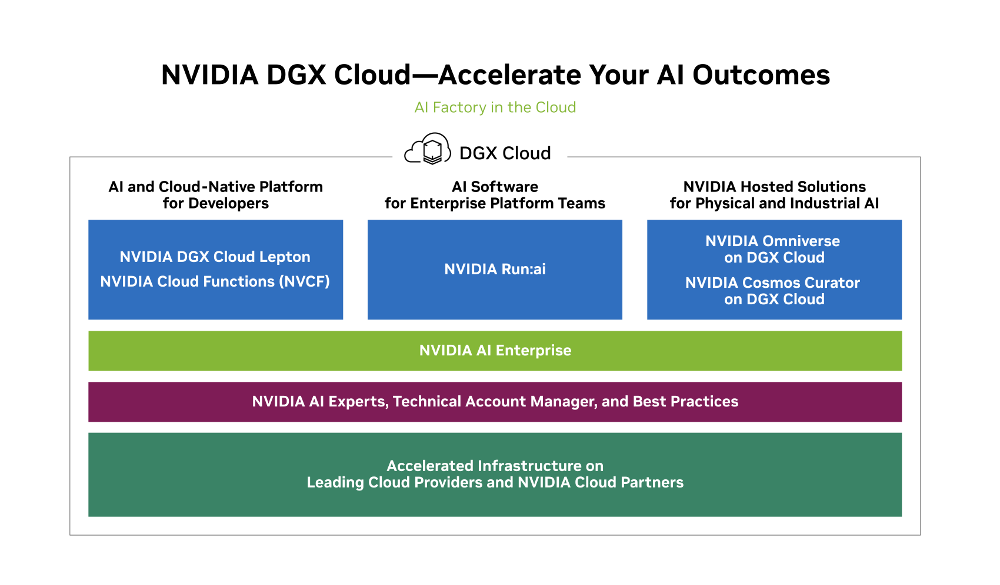
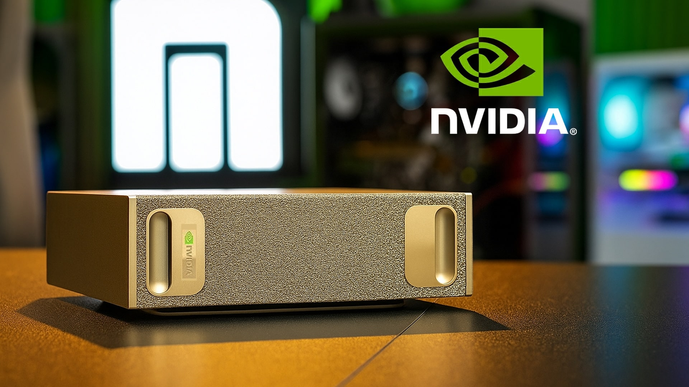
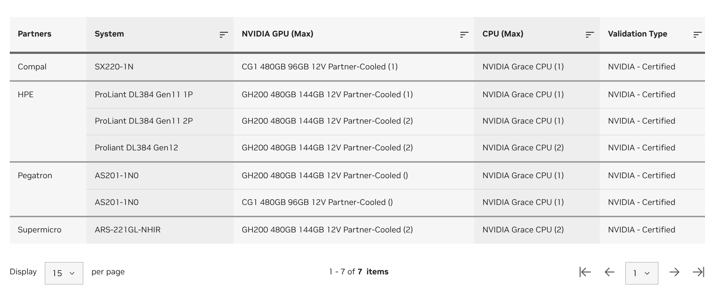

I've been trying to wrap my head around NVidia's portfolio to get a better understanding of the company. I'm very familiar with the consumer GPUs and parts of the data centre portfolio, but it's taken me much longer to understand than expected! I kept coming up against marketing buzzwords and confusing naming - so this is a quick blog post to document my current understanding. I was particularly motivated to write this after reading about NVidia's announcement in December 2025 - about reprioritising their [DGX Cloud](https://archive.is/20260101141816/https://www.theinformation.com/articles/nvidia-restructures-cloud-team-retreating-aws-competition) offering. I wanted to understand what that meant in context of their wider portfolio.

<!--more-->

There will be inconsistencies or issues with this post - as NVidia's portfolio has a pretty confusing layout from the outside, with more confusing naming (DGX and RTX are very different things, for example). I may well come back and make changes, or issue an updated article in the future as my understanding gets better - or when the portfolio inevitably changes!

I specifically **don't cover the chip taxonomy** in this article, as it is actually more simple to understand than the wider portfolio. It frustrates me so much that the naming isn't alphabetically ordered, though! What comes first - Ampere, Blackwell, Hopper, etc? So frustrating. Anyway, the Wikipedia list does a fantastic job of that: https://en.wikipedia.org/wiki/List_of_Nvidia_graphics_processing_units

Lastly, I've tried to boil off as much of the marketing buzzwords as possible, and explain things as simply as possible - so that people can use it for their own learning without having had much background. I've tried to cite sources as much as possible, and I'm wary that even popular go-to resources like Wikipedia are quite out of date or misleading - as this space changes SO fast. I've tried to link to technical documentation whenever possible.

## Cloud Services

NVidia has a complex relationship with the cloud, and cloud services. It's a OEM to the cloud providers (eg: HGX), they're also a cloud provider (DGX Cloud), and a SaaS provider (DGX Cloud Lepton, Omniverse Cloud). They walk a very thin line indeed between collaboration and competition - retreating from some offers in late 2025 as previously mentioned.

* **DGX Cloud** - NVidia managed environments, hosted in partner datacenters. This is the part they they seem to be [re-prioritising](https://archive.is/20260101141816/https://www.theinformation.com/articles/nvidia-restructures-cloud-team-retreating-aws-competition), but it seems that the name lives on a category of cloud services, including those below.

This diagram from the NVidia website in early 2026 shows DGX Cloud as more like an umbrella brand, with several components like DGX Cloud Lepton as a separate service.

Source: [NVidia's DGX Cloud page](https://www.nvidia.com/en-gb/data-center/dgx-cloud/)

### Cloud Developer Services (1st column in diagram)

* [**DGX Cloud Lepton**](https://docs.nvidia.com/dgx-cloud/lepton/get-started/) - marketplace for **unused GPU capacity** across cloud providers. [Providers include CoreWeave, Nebius, AWS and Microsoft](https://archive.is/XT30O).
* [**NVidia Cloud Functions (NVCF)**](https://docs.nvidia.com/cloud-functions/user-guide/latest/index.html) - serverless functions with GPU access

### Cloud Platform Software (2nd column in diagram)

Run:ai is a Kubernetes-based GPU scheduler and orchestration platform for AI workloads. This is the main orchestration layer for "NVidia AI Enterprise".

Available as;

* [**Run:ai SaaS**](https://run-ai-docs.nvidia.com/saas/) - hosted by NVidia
* [**Run:ai Self-Hosted**](https://run-ai-docs.nvidia.com/self-hosted) - Hosted by you (this would make a fun homelab project for me one day!)
* [**Multi-tenant**](https://run-ai-docs.nvidia.com/multi-tenant/getting-started/overview) - For service providers to build your own Run:ai SaaS

### Cloud Hosted Solutions (3rd column in diagram)

* [**NVidia Omniverse on DGX Cloud**](https://docs.omniverse.nvidia.com/omniverse-dgxc/latest/index.html) - for simulation and collaboration, targets 3D workflows, digital twins, robotics, simulation, etc.
* [**NVidia Cosmos Curator on DGX Cloud**](https://docs.nvidia.com/dgx-cloud/cosmos-dgx-cloud/current/introduction.html) - curate video data sets for AI workflows.

### Section Notes

This took an alarming amount of time to compile this section together - joining up several pages of docs, websites, videos and articles. It looks simple to read as I've boiled it down to a couple of bullet points - but trust me that the original source material is not intuitive!

Here are a few section notes I am left over with;

* Parts of the NVidia website describe "Cloud" and "Data Centre" as separate things (as shown in this blog), and parts of the website describe "Cloud and Data Centre" as one thing. I'm not sure which is "correct" from an NVidia point-of-view yet.
* NVidia NGC is covered "cross portfolio" below

## Datacenter

This section was somewhat easier to grasp, but still I want to make a double reference to this Scan video, admittedly from 2024, which was really helpful in getting the first understanding quickly.

* [NVIDIA GPU servers - DGX, HGX, EGX, MGX - all you need to know](https://www.youtube.com/watch?v=F6trWXZiZHg)

I went on to do quite a bit more research beyond that of course, and still I'm trying to boil away all the unnecessary fluff and complexity down to a few simple bullet points.

### DGX Platform ("Deep GPU Xceleration")

First introduced with Pascal with the DGX-1, and continued in Ampere, Hopper and the current generation is Blackwell. [Wikipedia](https://en.wikipedia.org/wiki/Nvidia_DGX#).

#### [**DGX SuperPod**](https://resources.nvidia.com/en-us-dgx-systems/dgx-ai-4?ncid=no-ncid)

A "turnkey supercomputer" - hardware and software stack.

* **Hardware**
  * NVIDIA Vera Rubin NVL72 (Next Generation - Vera replaces Grace, Rubin replaces Blackwell - announced, not shipping yet)
    * [NVIDIA Rubin NVL8](https://www.nvidia.com/en-us/data-center/dgx-rubin-nvl8/) (single node - 4 Grace CPUs, 8 Rubin GPUs)
  * NVIDIA DGX GB300 (the rack-scale system): Grace CPU + NVIDIA DGX B300 (Current Blackwell Ultra Generation - this is shipping today)
  * NVIDIA DGX GB200 (the rack-scale system): Grace CPU + NVIDIA DGX B200 (Original Blackwell Generation)
  * NVIDIA Networking (see below)
  * High-performance storage (not sure what is being used - quite possibly NetApps)
* **Software**
  * NVIDIA AI Enterprise
  * NVIDIA Mission Control™
  * NVIDIA DGX Operating System
* **Lifecycle Services** - plan, deploy, train, testing, etc

The linked solution overview above is actually very informative.

#### [**GB300 NVL72**](https://www.nvidia.com/en-gb/data-center/gb300-nvl72/?ncid=no-ncid) - rack-scale systems

I thought it would be useful to take a closer look at the current generation of the rack scale systems. It seems like they can be purchased individually, outside of a SuperPod.

* Complete System, built by NVIDIA
* "G" in "GB300" = Grace-generation CPUs
* "B" in "GB300" = Blackwell-ultra-generation GPUs
* "300" in "GB300" = Generation, with GB200 being older.
* "NVL72" = 72 Blackwell Ultras connected with NVLink, and 36 ARM NVidia Grace CPUs.
* Networking with NVidia Quantum-X800 or Spectrum-X (more on  this below).
* Storage - not much mentioned here, but I've seen mentions to NetApps, etc.

#### [**DGX Spark**](https://www.nvidia.com/en-gb/products/workstations/dgx-spark/)

Desktop AI "supercomputer", 128GB unified memory (LPDDR5x), small form factor. Comes with all the software needed to be useful.

### HGX - a reference architecture for the GPU Complex

OEMS use the HGX reference architecture for the GPU complex, and then build the rest of the system around it.

It defines:

* NVLink/NVSwitch topology
* Power delivery
* Cooling approach
* How GPUs are presented
* It does not include software

Examples include;

* [SuperMicro AS-8125GS-THN](https://www.supermicro.com/en/products/system/gpu/8u/as%20-8125gs-tnhr)
* [Dell XE9680](https://www.dell.com/en-uk/shop/ipovw/poweredge-xe9680)
* [Thinksystem SR680a](https://lenovopress.lenovo.com/lp1909-thinksystem-sr680a-v3-server)

The NVidia Qualified system catalog has a list.

### MGX - a reference design for servers

This is the level above HGX, and all MGX servers depend on HGX.

It defines;

* Chassis dimensions
* Board layouts
* GPU Options
* CPU Options
* DPU Options
* Networking layout
* How parts can be swapped

There are standards that cover 1-GPU servers, 2-GPU servers, etc.

I think what is most interesting is looking at the MGX systems for the current generation Grace CPUs by NVidia. At the time of writing, if you select "Data Centre" certification, with current generation Grace CPUs, there are just 7 certified machines.

Source: [NVidia Qualified System Catalog](https://marketplace.nvidia.com/en-us/enterprise/qualified-system-catalog/?locale=en-us&cpu=NVIDIA+Grace+CPU&nvidiaCertificationType=dataCenter&page=1&limit=15)

Here are some of the Grace servers built by OEMs;

* **Compal**: [SX220-1N](https://www.compalserver.com/product/sx220-1n/)
* **Pegatron**: [AS201-1N0](https://svr.pegatroncorp.com/products/server/ai-gpu-server/as201-1n0)
* **SuperMicro**: [GPU ARS-221GL-NHIR](https://www.supermicro.com/en/products/system/gpu/2u/ars-221gl-nhir)

If you select Intel or AMD CPUs - there are many many more.

# EGX

These were origianlly servers designed for edge, but it seems NVidia has shifted this to mean "validated for edge". This validation has tighter controls on power, thermals, form factors, etc.

These often run NVidia's edge AI stack - CUDA, DeepStream, Triton, etc. Often Kubernetes.

Many EGX servers are just servers with many PCI-E connections, for pluggable GPUs (much like consumer GPUs - just more of them).  They provide a choice of GPU, CPU, storage - CPU can be AMD, Intel, etc.

### Networking & Connectivity (brief)

I'm not quite sure where to pop this section as it could be across several, but I'm placing it in the Datacenter section with the notes I have a the moment because otherwise I'll never finish this blog post!

* **NVLink** - GPU <-> GPU Connectivity on the same physical server.
* **Infiniband** - the networking technology that came from Mellanox, classically used in HPC
- **Spectrum X** - an integrated stack that consists of Spectrum Ethernet switches, BlueField DPUs (smart NICs) and a tightly coupled software stack.

### Section notes

* OVX systems - I've decided not to cover OVX systems
* IGX - Functional safety and security for edge AI.

## Embedded (brief)

* **Jetson** - Platform for robotics and embedded apps.
* **Drive AGX** - in-vehicle computering
* **Clara AGX** - medical devices and imaging

## Gaming (brief)

This part of the business is all OEM. I've only got super high level commentary here for completeness, because this area of the business is well understood and straightforward.

* **GeForce** - Consumer GPUs. [Wikipedia has a fantastic list](https://en.wikipedia.org/wiki/List_of_Nvidia_graphics_processing_units)
  * Built by MSI, Gigabyte, Asus, etc.
  * [**RTX**](https://en.wikipedia.org/wiki/Nvidia_RTX) - Ray tracing hardware functionality,  introduced in 2018. RTX of course exists in the datacenter GPUs too.
  * DLSS - Frame generation with AI
  * Simple generations: 30xx, 40xx, 50xx, etc.
* **Laptops** - built by MSI, Gigabyte, Asus, etc
* **G-Sync Monitors** - built by LG, Thermaltake, Corsair, MSI, etc.

## Software (brief)

I haven't yet had the time to look into the software stack in detail, and this blog post is already exceptionally long. I may cover NVidia software in a follow-up article.

## Cross Portfolio Offers

* **NGC** ([ngc.nvidia.com](https://ngc.nvidia.com/)) - NVidia's content delivery platform. A portal/registry of content for their accelerated software ecosystem. It includes;
  * Container Registry - images, helm charts, etc, like [ArtifactHub](https://artifacthub.io/)
  * Model Registry for models, like [HuggingFace](https://huggingface.co/)
  * Software Catalog - SDKs, etc.

## Predictions

There are many things that anyone could predict with NVidia, and I would say that identifying structures and building taxonomies is where my skills lie - less in making predictions. However, here is a few things to think about, more like "open questions"

* NVidia seems to continue walking a fine line of collaboration and competition with the rest of the market - and their pivot in branding / use of DGX cloud is a good example of this. In 2026 they also announced that Vera CPUs will be available without being coupled  to Blackwell GPUs - and made generally available via CoreWeave. This means they're taking on Intel and AMD even more than before - something to watch out for.
* This rate of hardware innovation is incredibly impressive, but the lifetime and lifecycle of this hardware is just so incredibly short - almost 12 months. This could prove difficult for long term sustainability.
* No other hardware vendor seems to be keeping up with NVidia's rate of hardware innovation, and their strong hold on the software stack, drivers, etc, gives them a monopoly. History has shown us that this likely to topple in the long run.

## Summary

This blog post took a lot longer to write than you might expect, for what is basically a collection of bullet points. However, hopefully you find it to be a useful cut across a bit of everything that NVidia does, with less marketing words, and a quick few lines that explain what each and everything does.

The NVidia ecosystem is really quite complex, with terms that can change (DGX Cloud, EGX), and unintutive "ordering" in product names - (Ampere, Hopper, Blackwell). I look forward to diving even deeper into this in time :-)

## General References

* [NVIDIA GPU servers - DGX, HGX, EGX, MGX - all you need to know](https://www.youtube.com/watch?v=F6trWXZiZHg)
* [NVidia Datacenter GPUs explained, every model in 2024 covered](https://www.youtube.com/watch?v=4s4_cRNA46Q) (YouTube Video) - older video, but very informative for a quick high level overview.
* [RTX on Wikipedia](https://en.wikipedia.org/wiki/Nvidia_RTX)
