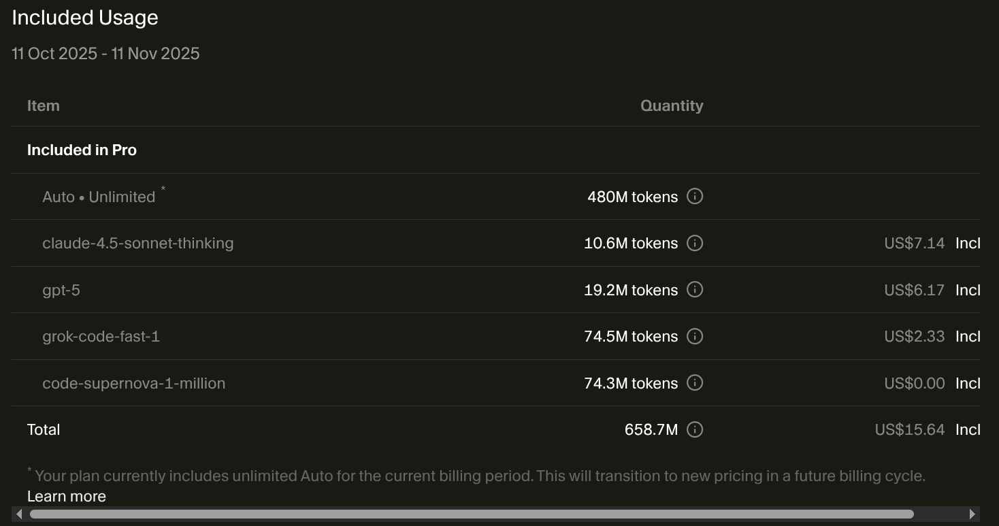

This is a very quick blog post, intended as a note to look back on, or to share with with people quickly - a snapshot of my AI usage in November 2025. It's likely that this will change rapidly over the next few months and years, so I want to capture a moment in time.

80% of my queries now land in AI, 20% in traditional search engines.

It will be interesting to see how this changes over time!

## Primary AI Tools I Use

### ChatGPT (https://chatgpt.com)

- **Costs:** $20/month - personal/plus.
- **Frequency:** hourly, constantly have a tab open.
- **Model selection:** automatic 90% of the time.
- **Use cases:**
  - Brainstorming ideas
  - Search - like getting a list of known tools, eg: "What tools compliment Vue, Golang, etc?"
  - Quick questions, general research, etc
  - Checking tone and checking how a message might be perceived (emails, messages, etc)
  - API endpoint mostly for n8n integrations

### Cursor AI - AI assisted IDE (https://cursor.com/)

I have to say that I was very surprised to like this, being such an avid Vim user. 

- **Costs:** $20/month - "pro" plan.
- **Frequency:** Hourly, constantly have a tab open.
- **Model selection:** automatic 90% of the time.
- **Use cases:**
  - Code generation, code explanation, refactoring suggestions
  - Set to "auto" mode for model selection most of my coding sessions

### Coderabbit AI

I was introduced to Coderabbit AI via Postiz, and I have to say the quality of the detection and suggestions is just exceptional. It's actually quite scary how good it is. It's purely reviewing Pull Requests on GitHub across the projects I care about - like OliveTin.

- **Costs:** $15/month - "lite" plan
- **Frequency:** Daily (automated)
- **Model selection:** unknown
- **Use cases:**
  - Automated code reviews on GitHub PRs
  - Code quality suggestions

### Google Gemini - pro, paid for with work

- **Costs:** $20/month - personal/plus.
- **Frequency:** maybe once per week
- **Use cases:**
  - Only used for work / confidential data, as it's an approved tool from my employer.

### Claude

- **Costs:** free plan - with $5 credits that last for several months.
- **Frequency:** maybe once per week
- **Use cases:**
  - I don't use it directly anymore - I just wanted to see if there was anything differentiating it from ChatGPT.
  - I did have a few n8n calls, but switched those to ChatGPT.

## Tools I plan to use in the next 3 months

- Open Router - https://openrouter.ai/ - to provide compatibility across multiple models, especially for n8n
- Open WebUI - https://github.com/open-webui/open-webui
- RunPod - https://www.runpod.io/ - to try self-hosted models

