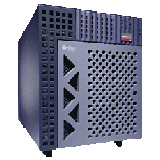
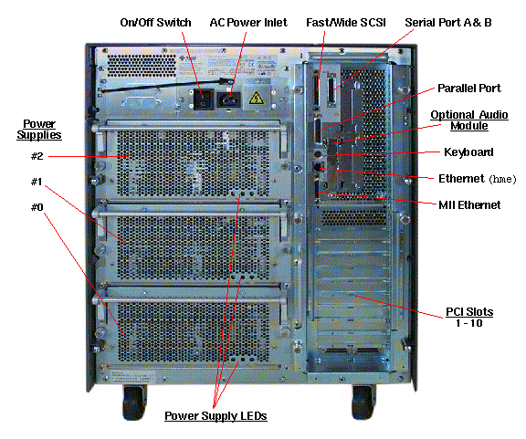
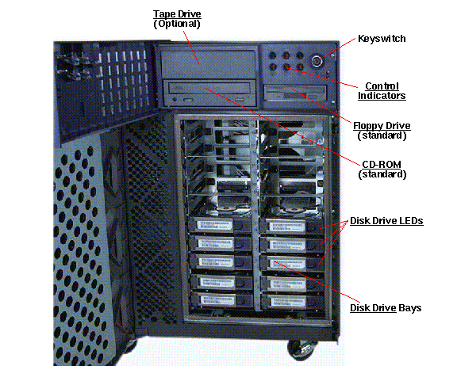

I got a SUN E450 workstation for free back in the mid 2000s. I got it because it looked super cool, but I wish I had more skills back then to be able to use it!

Back in the mid 2000s, I was helping my Dad move his offices from one site to another. While we were there, I had spotted another company that was moving out the offices at the same time, and in particular, saw what looked like a very cool computer. 

Being a teenager at the time, probably about 16 or 17, I used my childish charms to ask the owners if I could have it, and to my surprise, they said yes! I had absolutely no idea what it was, and I started regretting it soon afterwards when I realised just how heavy it was!

It turned out to be a SUN E450 workstation, which was a high-end workstation from Sun Microsystems, released in the late 1990s. It was designed for demanding applications such as 3D rendering, scientific computing, and software development. The E450 was part of Sun's Enterprise series and was known for its powerful performance and scalability. 

That picture doesn't do it justice - it's a big machine! When searching now in 2025, I found that someone kindly mirrored the E450 manual here (which is where I got these images from); https://shrubbery.net/~heas/sun-feh-2_1/Systems/E450/E450.html . However, when looking in the mid 2000s, I could not get much information about it in the public domain. 

I remember looking at the rear, and recognising the power cable at least - I plugged in a standard UK Kettle Cable and the machine roared to life.

Of course I am a child of the Windows 95 PC generation. I didn't see a VGA port for my monitor - I had no idea how to connect a monitor to this thing. I'm sure there were optional PCI cards for  this, but I had no idea how to find out about that stuff back then really. 

After a bit of searching, I did stumble across #solaris IRC channel which was a bit of help. They had suggested connecting to the machine via serial cable. 

This was the first time I had really had to use serial - if that ages me. I was familiar with parallel ports from printers, but off to Maplins (UK Electronics retailer, now gone out of business) - to buy a serial cable on my bike! A 3h round trip...

I was used to connectors just working with my simple PC hardware, so my excitement was short lived when I returned home, I figured out that the DB9 to DB9 serial cable I bought wasn't going to work... That's because because it was actually a DB25 port on the back of the E450! Oh well, back on the bike to find a DB9 to DB25 adaptor!

Unfortunately I just didn't have the guidance or support from IRC, and I didn't know anybody else at the time who had used any of this sort of hardware. My journey rather abruptly ended soon after not understanding how to get a terminal program working to connect to the E450 via serial.

Nevertheless, I thought it was super cool just to look at the physical side of this hardware. I'd never seen things like the hot-swappable SCSI drives before, and the whole thing just looked like a beast of a machine.

The build quality really was something else. The whole thing was made of metal, and it felt like it could withstand a nuclear apocalypse. Ah I wish I just had the skills back then to be able to use it!

There are any number of videos of the Sun E450 on YouTube, and I've got a much better idea now of the technical specs. Maybe I'll get more of this enterprise style hardware again in the future to play with!

- https://www.youtube.com/results?search_query=sun+e450 

