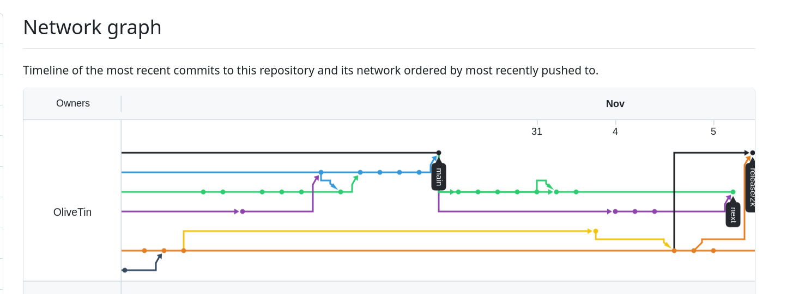
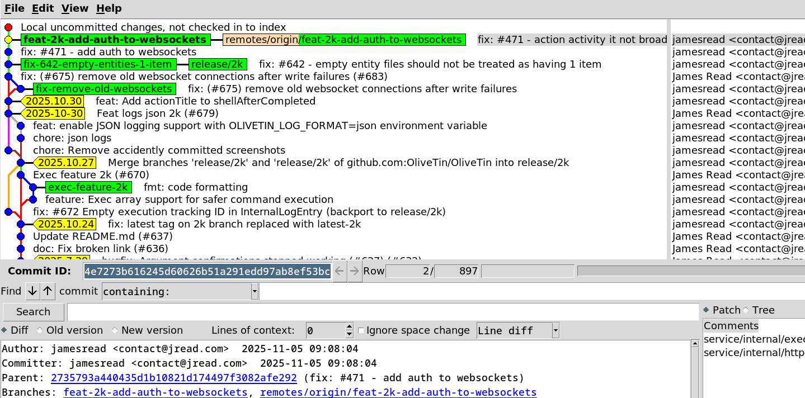
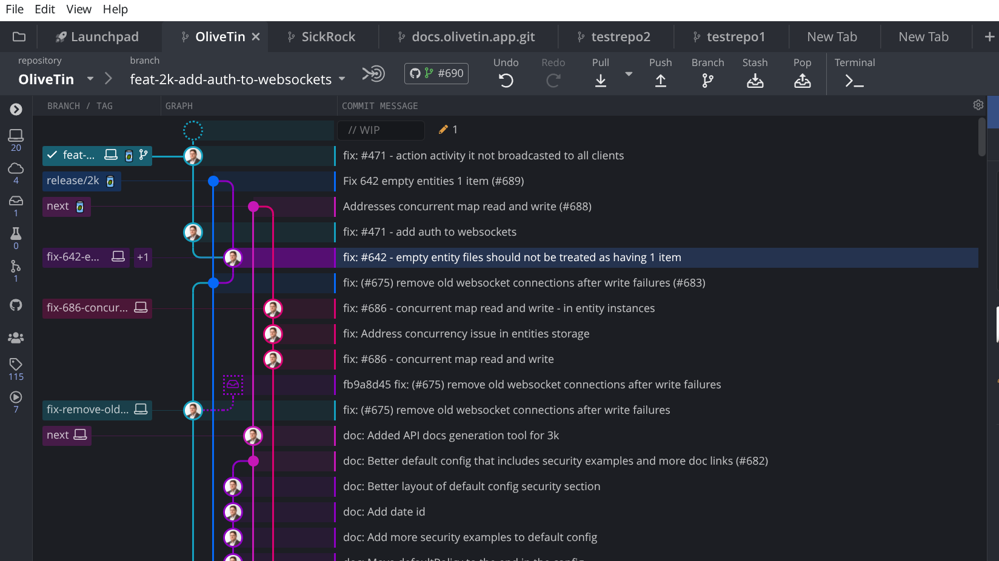
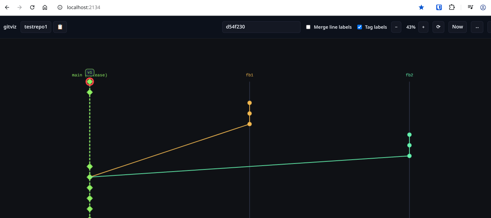
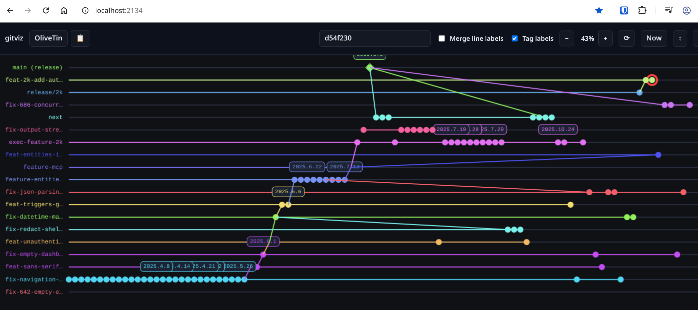

I fondly remember this quote when I first heard it - and it made me chuckle. However this is such a good reminder of "GIGO" (Garbage In, Garbage Out) that is so relevant in today's world of AI and especially Vibe Coding.

> 'Pray, Mr. Babbage, if you put into the machine wrong figures, will the right answers come out?'
> - Charles Babbage

Garbage In, Garbage Out is a principle of systems design, and also common sense, that simply means that if you feed in the wrong questions, clearly you will get the wrong answers. I encountered this problem recently in a little vibe coding experiment of my own.

## GitViz

I was becoming frustrated as I split up one of my projects, OliveTin, into two separate release streams, and found that many of the branch visualisation tools I was using were not really giving me a clear visualisation I wanted. Here's GitHub's network graph - which I think is one of the best;

It's OK, but it's difficult to inspect parts of the graph that way. Wanting a little more detail, I launched `gitk`, which I do use quite often;

The interface is old, but I do really like it and it's incredibly effective. However, I wanted to see the two "clear release streams" really broken out from the other branches. I started looking at the closed source paid options (erw, I know). The one I've heard of quite a bit is GitKraken, so I downloaded it and gave it a try;

It's obviously very pretty, but I actually found this interface /more/ confusing to look at. I seems weird to me how the branches are coloured, and I didn't really seem to find options to customise the branch colours or layout. 

Something in particular that was very confusing, is that new branches, from main for example, continue the "column" of the base branch. I guess they do this to save on space, but this is kind of the opposite behaviour of what I wanted to see. I wanted to see the branches clearly broken out from each other.

## Vibe Coding to the Rescue?

> I'm a developer with a hammer, so every problem becomes a nail.
> - James Read - *said too often*

> "How hard can it be?"
> - Famous last words of every developer

So I thought, "okay, let's see if we can throw something together with vibe coding". I fired up Cursor, and threw in some prompts. Initially, I thought I wanted a "desktop interface", so I asked it to draw a "canvas like drawing" with Qt - the best out of the bad cross platform UI toolkits. I wish I'd saved some screenshots of that early version, but in as little as 2 minutes after starting, I had the early visualisation of my Git tree. 

> "All this in 2 minutes? Wow, AI is amazing!"
> - Famous last words of humans

However, is was slow. I mean, really slow. I was getting null pointer exceptions 50% of the time (which the AI could not find and fix), and so as easy as it was to create the QT interface, I simply said "Now, use an environment variable called UI, that can be either 'qt' or 'gtk', and implement the 'gtk' version".

It did. Very quickly, I had a Gtk version. I had to install a bunch of nonsense dependencies for C compilation - but that was easy. 

Didn't like it. I like the web as a platform, just too much. So, like god on the 5th day of Genesis: "Let there be web!", and it was done.

The web interface was niceeeee. Here's what we got in about 20 minutes worth of "effort" - but it wasn't effort, it was me chatting with Cursor while I was mostly watching NetFlix on another monitor. 

Looking good!

Okay, actually this screenshot is from a much later iteration - I'd asked it to add zoom levels, scrolling, labels, etc. But the main "drawing" looked the same.

Something that I was really proud of, that I can take absolutely ZERO credit for (because AI did it), is the ability to flip between horizontal and vertical rendering. Let's look at a more complex repository with horizontal rendering:

It looks great, but if you look closely - something isn't QUITE right. 

All those labels for the 3k version, they're all showing on different branches. They should instead all be on "main". The reason for this bug, is that I was feeding it prompts like this;

> Now draw all the commits on a line with their corresponding owning branch.

If you know Git, you know the problem. This prompt is garbage in, and the AI is going to happily respond by giving me garbage out.

If you don't know how Git works internally (and to be honest, I don't), you'd know that Git commits do not "belong" to branches. Branches are simply pointers to commits. A commit can be pointed to by multiple branches, or no branches at all (in the case of dangling commits).

So when I asked it to "draw all the commits on a line with their corresponding owning branch", it tried to do exactly that, and assigned each commit to a single branch. Despite my attempts to correct it, with prompts like this;

> No, that's wrong, commit `abc123` in the testingRepo belongs to branch `main`, not branch `feature-x`.

It kept on "getting it wrong" - because I was continuing to feed it garbage in.

In the end, I had to really understand how Git works internally, and understand that branches are just pointers to commits. All these visualisation tools that "looked pretty simple" have to use a heuristic to actually associate a commit with a "owningBranch". As with all programming, I got 90% of the way there in 10% of the time, and now I'm going to use 90% of the time to finish the last 10% of the work - fixing the branch ownership logic.

Actually, while writing this, Cursor and I still haven't yet found a heuristic that works reliably. 

## Conclusion

Vibe coding is amazing. It can get you 90% of the way to a solution in a fraction of the time it would normally take. However, if you feed it garbage in, you're going to get garbage out. 
