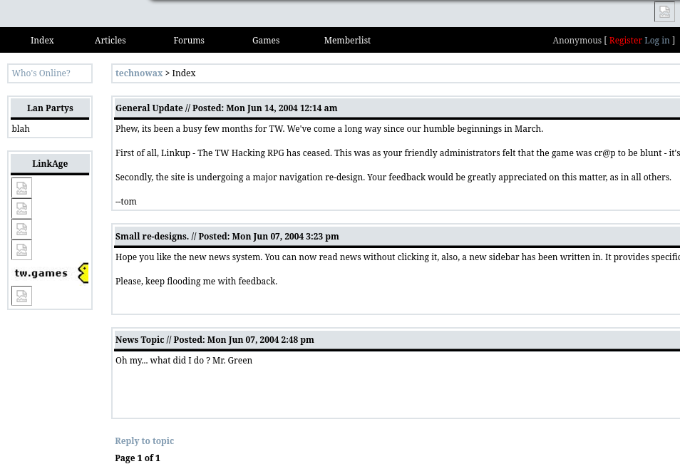

The bluey-grey color that you see in nearly all of my projects has the HTML color code #dee3e7. It came from the very first "real" web project I worked on when I was about 16 years old, and I knew nothing! That website has had so many versions over the years, but it's first version was built with PHP4.3, XHTML 1.0/HTML4.01 and CSS2.1 - and it was a mess! But I loved it, it taught me so much about web development, and it was my gateway into the world of web programming.

When I was designing that site, you can see that my design asthethic was very simple, partly because I like clean and simple designs, but also partly because I put more emphesis and interest into the backend functionality than the design. When I was selecting colors for the site, I just chose #dee3e7 probably from a random color picker.

As I went on to build more and more applications, it was very easy for my muscle memory to remember white, black, and just #dee3e7 stuck in my mind as a color when I wanted a bit of color. I've used it in nearly every project since then, and I've grown to love it. It's a very calming color, and it's not too bright or too dark. It's just right.

Here's just a small sample of some of the projects since technowax, where I've kept basically the same design asthetic, #d33e7, and similar colors.

")

")

")

")

While #dee3e7 isn't going anywhere, there are several other colors that I sent to reuse again and again in my projects - several of them you can see above. I typically stick to named HTML colors, like `salmon` for error messages, or easy to remember hex codes like `#444` for header background colors. I totally appreciate that my color choices are prehaps a bit boring, but I like them, and they work fine for me. I'm not a designer, I enjoy writing code!

As a form of simple amusement, I've created a showcase theme page for what can loosely be described as my design asthetic.

 theme on GitHub.")

Lastly, in the spirit of going too far, I also use [the same color scheme for my desktop](../my-desk-has-6-monitors) :-)
